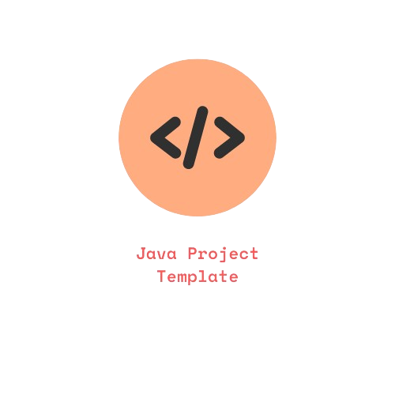

     

## About

This is a template repository for Java Projects using Gradle. It includes the following features:

- [x] Java 21
- [x] Gradle 8.5
- [x] JUnit 5
- [x] EditorConfig
- [x] CodeCov
- [x] GitHub Actions

## Getting Started

### Prerequisites

- Java 11 or higher
- Gradle 7.0 or higher
- Git
- Your favorite IDE

### Installation

#### Use Template Button

- Click the green "Use this template" button at the top of the repository.
- Enter a repository name and description.
- Click "Create repository from template".
- Clone your new repository.
- Update the `README.md` file.
- Update the `settings.gradle` file.
- Update the `gradle.properties` file.

#### Manual Setup
- Clone this repository.
- Delete the `.git` folder.
- Initialize a new git repository.
- Update the `README.md` file.
- Update the `settings.gradle` file.
- Update the `gradle.properties` file.
- Update the `build.gradle` file.

Insert usage instructions here.

## License

Licensed under the GNU Affero General Public License v3.0. See [LICENSE](LICENSE.txt) for more information.