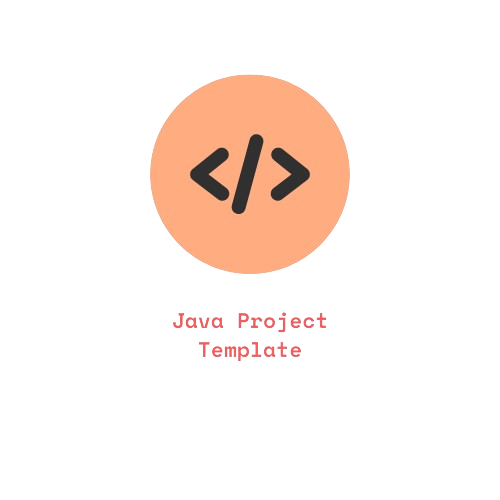

<link rel="stylesheet" type="text/css" href="../styles/style.css">

<p align="center" width="100%">
     
</p>

<div style="text-align: center">

[](https://search.maven.org/artifact/your-group-id/your-artifact-id)
[](https://codecov.io/gh/AmmoniumStudios/java-project-template)

</div>

## About

Insert a short description about your project here.

## Getting Started

### Prerequisites

- Java 11 or higher
- Gradle 7.0 or higher
- Git
- Your favorite IDE

### Installation

1. Clone the repository

```sh
$ git clone <repository-url>
```
2. Build the project

```sh
$ gradle build
```

3. Run the project

```sh
$ gradle run
```

## Usage

Insert usage instructions here.

## License

Licensed under the GNU Affero General Public License v3.0. See [LICENSE](LICENSE.txt) for more information.